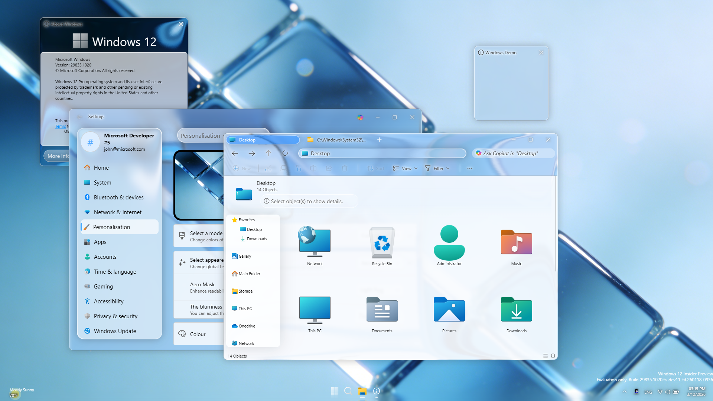

# Windows 12概念版介绍



本项目主要改进液态玻璃特性，让开发者能够快速上手

# 创建窗口

首先在`@/views/home/components`目录下创建一个文件夹，起名`demo`，在此文件夹下新建`index.vue`文件，内容如下：

```vue
<template>
  <liquidWin title="Windows Demo" :width="200" :height="200" :displacementScale="200" @updatePos="updatePos"
    :active="props.active" :winPattern="0" v-model:top="top" v-model:left="left" @close="close">
  </liquidWin>
</template>

<script setup>
// 基本窗口必需库
import LiquidWin from "/src/components/liquid_win.vue";
const top = defineModel("top")
const left = defineModel("left")
const props = defineProps({
  active: Boolean,
});
const updatePos = (top, left) => {
  emit("updatePos:top", top);
  emit("updatePos:left", left);
};
</script>

<style scoped>
@import "/src/assets/liquidglass.css";

.std-btn {
  margin: 10px;
  height: 32px;
  font-size: 14px;
  border: none;
  border-radius: 20px;
  padding: 0 10px;
  color: #fffc;
  box-shadow: #fff -0.5px -0.5px 0.5px, #fff 0.5px 0.5px 0.5px;
  background: linear-gradient(to bottom, #fff6, #8886);
}

.std-btn.primary {
  background-color: #24acf2;
}
</style>
```

然后在`@/views/home/index.vue`中，找到：
```js

// 1. 窗口配置列表 (只需在这里维护窗口名称)
const windowList = ["about", "explorer", "settings"];
```

在这个表后面添加：demo即可

拟态玻璃会自动适应窗口大小

# 开源注意事项

在发布视频、文章等内容时，请注明出处，并保留本项目的开源协议。